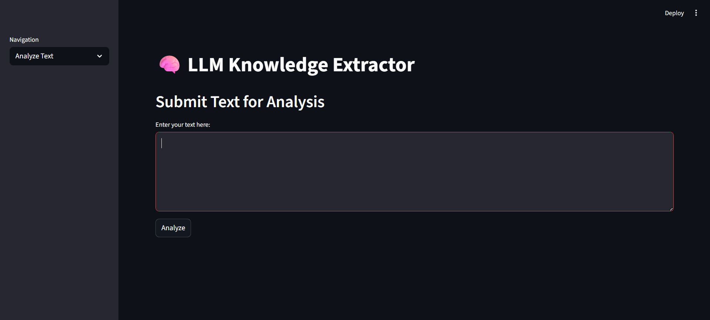
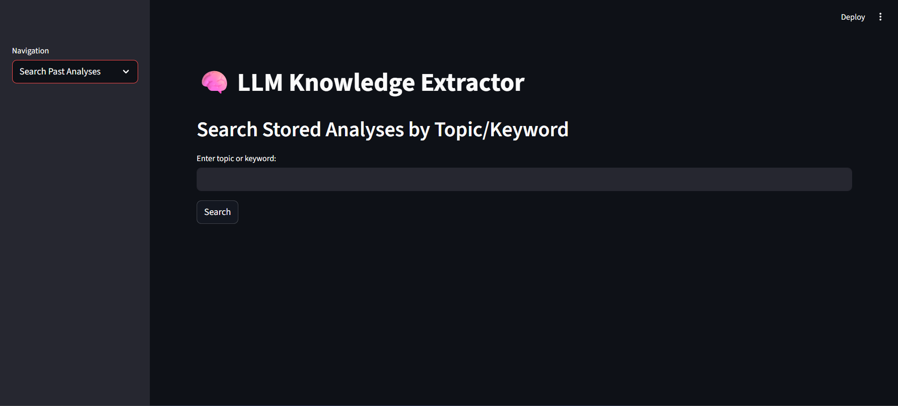
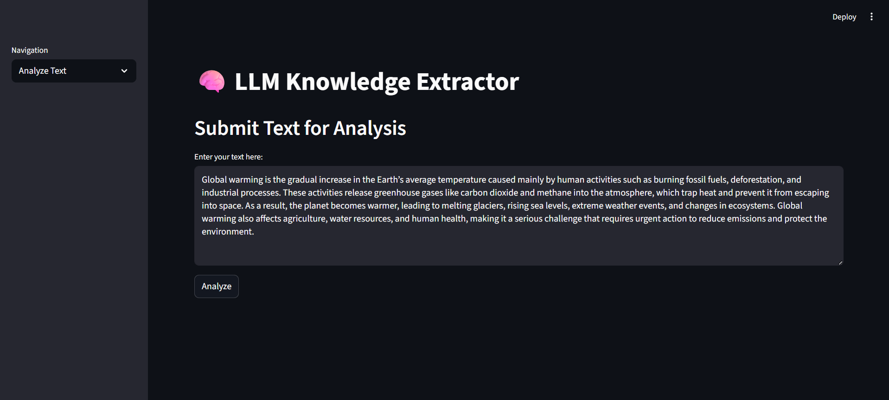
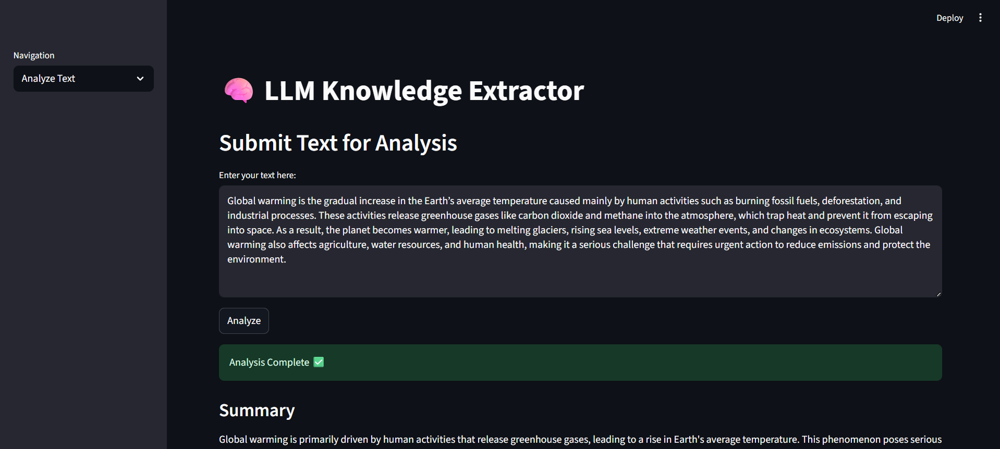
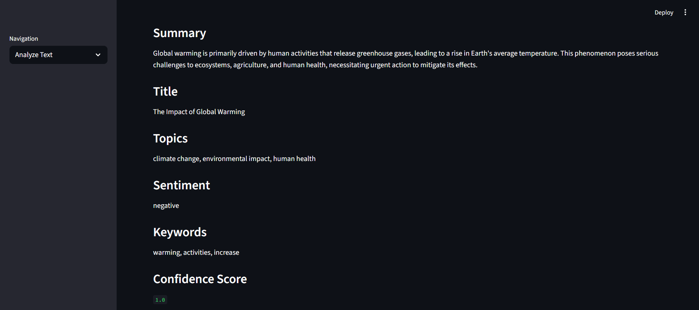
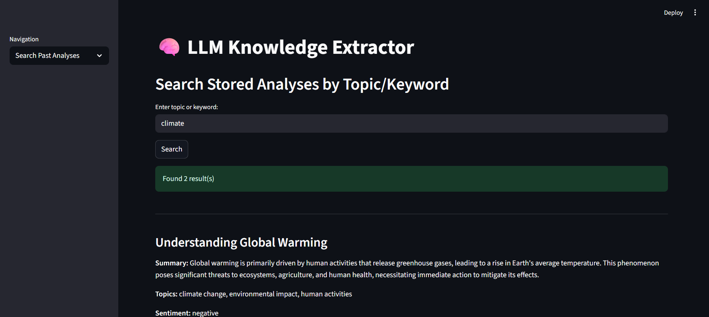

# LLM Knowledge Extractor

LLM Knowledge Extractor is a full-stack web application that leverages Large Language Models (LLMs) to analyze text, extract meaningful insights, and store them for easy retrieval. This project combines AI-powered text analysis, a robust backend, and an interactive frontend for a seamless user experience.

## Features

* **Text Analysis with LLM**
  Input any text and get:

  * Summary
  * Title
  * Topics
  * Keywords
  * Sentiment
  * Confidence Score
    The analysis is powered by OpenAI API and SpaCy for keyword extraction.

* **Search Past Analyses**

  * Query stored analyses by topic or keyword
  * Case-insensitive search
  * Returns all matching records from the database

* **Interactive Frontend**

  * Built using Streamlit
  * Modern, responsive design
  * Easy navigation and instant feedback

* **Persistent Storage**

  * Uses SQLite via SQLAlchemy ORM
  * Stores all analysis data for future reference

* **Dockerized**

  * One-command setup using Docker and Docker Compose
  * Run backend and frontend anywhere without worrying about dependencies

## Tech Stack

**Backend:**

* FastAPI – High-performance Python framework for building APIs
* SQLAlchemy – ORM for managing SQLite database
* SQLite – Lightweight database for storing analyses
* OpenAI API – For text analysis using GPT models
* SpaCy – For keyword extraction
* Python 3.13 – Main programming language

**Frontend:**

* Streamlit – Interactive Python framework for building UI
* Requests – For communicating with backend APIs

**Other Tools:**

* Docker & Docker Compose – Containerization for easy deployment
* Python Virtual Environment – Isolated environment for dependencies

## Project Structure

```
llm-knowledge-extractor/
│
├─ app/
│   ├─ main.py          # FastAPI backend entrypoint
│   ├─ models.py        # Database models
│   ├─ schemas.py       # Pydantic schemas
│   ├─ services.py      # LLM + keyword extraction logic
│   └─ ui.py            # Streamlit frontend
│
├─ .venv/               # Python virtual environment
├─ Dockerfile           # Docker setup for backend
├─ docker-compose.yml   # Docker Compose for backend + frontend
├─ requirements.txt     # All Python dependencies
└─ README.md
```
## Running with Docker (Recommended)

1. Build and run using Docker Compose:
   `docker-compose up --build`

2. Access the app:

   * Backend API: `http://localhost:10001`
   * Frontend UI: `http://localhost:8501`


## Installation and Setup (Optional)

1. Clone the repository:
   `git clone https://github.com/Kartik788/llm-knowledge-extractor.git`
   `cd llm-knowledge-extractor`

2. Create a Python virtual environment:
   `python -m venv .venv`

3. Activate the virtual environment:
   `.venv\Scripts\activate` (Windows)
   `source .venv/bin/activate` (Linux/Mac)

4. Install dependencies:
   `pip install -r requirements.txt`

5. Install spaCy English model:
   `python -m spacy download en_core_web_sm`

6. Run backend server:
   `uvicorn app.main:app --reload --port 10001`

7. Run frontend UI:
   `streamlit run app/ui.py`


## Screenshots









## Dependencies

* fastapi
* uvicorn
* sqlalchemy
* pydantic
* requests
* openai
* spacy
* streamlit

## How It Works

* Users submit text through the Streamlit UI.
* Backend receives the text via FastAPI `POST /analyze`.
* LLM + SpaCy generate summary, title, sentiment, topics, keywords, and confidence score.
* Results are stored in SQLite database.
* Users can search past analyses using `GET /search?topic=xyz`.
* Search is case-insensitive and matches both topics and keywords.

## Notes

* Topics and keywords are stored in lowercase for consistent searching.
* Confidence score indicates how confident the model is about its analysis.
* Docker ensures environment consistency, removing the need for manual dependency installation.

## Future Improvements

* Add user authentication for personalized history
* Implement advanced filtering and analytics dashboard
* Integrate more LLM models for richer analysis

## Credits

* OpenAI – GPT models for text analysis
* SpaCy – Keyword extraction
* FastAPI – Backend API framework
* Streamlit – Interactive frontend
